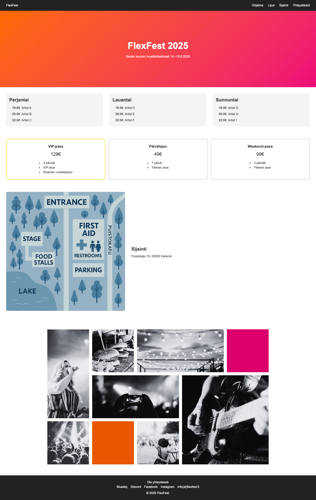

# 🎶 FlexFest 2025

FlexFest 2025 is a responsive festival website that showcases the event program, tickets, location, gallery, and contact details.  
The site is built with **HTML5** and **CSS3**, designed to work on both desktop and mobile devices.

## 📸 Screenshots

------

## 🚀 Features
- **Navigation** – clear header with links to different sections of the page  
- **Hero section** – highlighted event name and dates  
- **Program schedule** – three-day lineup with times and artists  
- **Tickets** – day pass, weekend pass, and VIP pass displayed in card layout  
- **Location** – event map and address details  
- **Gallery** – CSS Grid-based gallery for images of different sizes  
- **Footer** – social media links and contact information 

----

## 🛠 Technologies used
- HTML5  
- CSS3 (Flexbox & Grid)  
- Responsive design (media queries) 

----

## 📂 Project structure
/
├── index.html # Main HTML structure
├── style.css # Stylesheet
└── images/ # Images (festival area & gallery)

-------
## 📚 What I Learned

During this project, I improved my skills in:  
- **Responsive design** – using media queries to adapt layouts for desktop and mobile  
- **Flexbox & Grid** – creating flexible layouts for the calendar, tickets, location, and gallery  
- **CSS styling** – hover effects, card designs, gradients, and spacing  
- **Project structure** – organizing HTML, CSS, and images efficiently  
- **Accessibility basics** – using semantic HTML elements and alt attributes for images  

-------

## Links

[GitHub](https://github.com/1967cooder/harjoitukset/tree/main/Portfolio%20Silvana/01_flex-projecti%20copy)

[Live demo](https://flexfest.netlify.app/)

----
## 👩‍💻 Author

GitHub – [1967cooder](https://github.com/1967cooder)  

Portfolio: [Live Demo](https://portfoliosilvana.netlify.app/)

GitHub [1967cooder](https://github.com/1967cooder/)

LinkedIn: https://www.linkedin.com/in/silvanalindholm

Email: silvanalindholm@hotmail.com

Frontend Mentor - [@1967cooder
](https://www.frontendmentor.io/profile/1967cooder)
