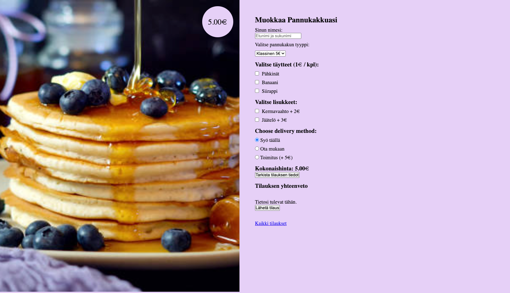
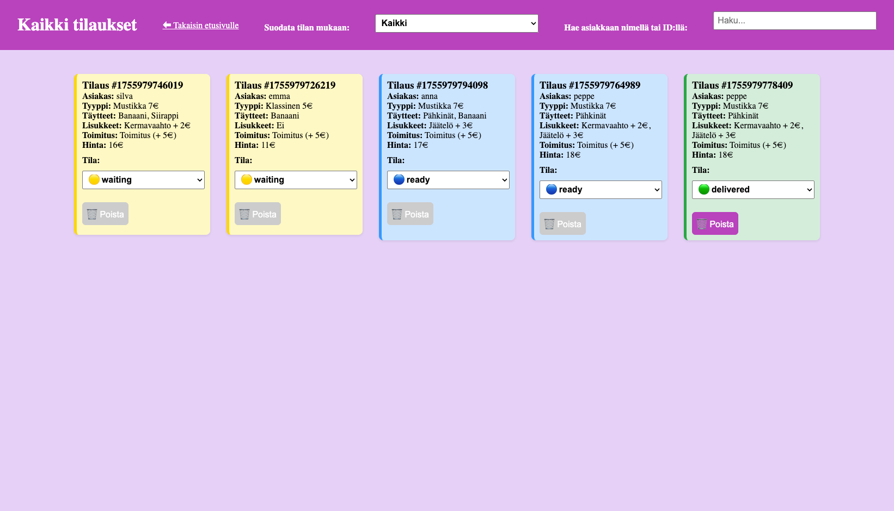

# 🥞 Pannukakkusivu 3 – Tilauksien hallinta

Tämä projekti on osa harjoitustyötä, jossa toteutettiin interaktiivinen pannukakun tilaussivu sekä erillinen hallintasivu tilausten käsittelyyn. Projektissa käytettiin **HTML**, **CSS** ja **JavaScript** -tekniikoita sekä **localStorage**-tallennusta.

---
## screenshot




## 📋 Projektin sisältö

### 1. Pannukakun tilaussivu (`index.html`)
- Käyttäjä voi:
  - Syöttää oman nimensä.
  - Valita pannukakun tyypin (eri hinnat).
  - Valita täytteitä (1 € / kpl).
  - Valita lisukkeita (2–3 €).
  - Valita toimitustavan (syö täällä, ota mukaan, kotiinkuljetus +5 €).
- Sivulla näytetään **kokonaishinta reaaliajassa**.
- Käyttäjä voi tarkistaa yhteenvedon tilauksestaan.
- Tilauksen vahvistaminen tallentaa tiedot **localStorageen**.

---

### 2. Tilauksien hallintasivu (`orders.html`)
- Näyttää kaikki tallennetut tilaukset.
- Jokaisesta tilauksesta näkyy:
  - Tilausnumero (ID)
  - Asiakkaan nimi
  - Valittu pannukakku
  - Täytteet ja lisukkeet
  - Toimitustapa
  - Kokonaishinta
  - Tila (status)
- **Kokin toiminnot:**
  - Tilauksen tilan päivittäminen (`waiting → ready → delivered`).
  - Hakutoiminto (etsintä asiakkaan nimellä tai ID:llä).
  - Lajittelu (esim. `waiting` ensin).
  - Tilauksen poistaminen (vain jos status = `delivered`).
- Eri tilat näytetään eri väreillä:
  - 🟡 **waiting**
  - 🔵 **ready**
  - 🟢 **delivered**
- Pääsy hallintasivulle vaatii salasanan: **`pannukakku123`**

---

### 3. Tilaus tallennetaan oliona
Esimerkki tilausobjektista:

```json

{
  "tilaus": 1755977600436,
  "asiakas": "Emma",
  "tyyppi": "Klasssinen",
  "täytteet": ["Pähkinät", "Siraappi"],
  "lisukkeet": ["Jäätälö"],
  "toimitus": "Toimitus",
  "hinta": 15,
  "tila": "waiting"
}
```
---------
### Käytetyt tekniikat

HTML5 – rakenne

CSS3 – tyylit, responsiivisuus

JavaScript (ES6) – logiikka, tilausten hallinta

localStorage – tietojen tallennus

-------

### Käyttöohje
Avaa index.html selaimessa.

Tee pannukakkutilaus ja lähetä se.

Siirry linkistä Kaikki tilaukset (orders.html).

Syötä salasana pannukakku123.

Hallitse tilauksia (päivitä, etsi, lajittele, poista).

-------

### Oppimiskokemukset

Tässä projektissa harjoittelin mm.:

Lomakkeiden käsittelyä ja dynaamista hinnan laskentaa.

Olioiden ja taulukoiden käyttöä tilausten tallentamiseen.

Tallennuksen toteuttamista localStorageen.

Tilauksen hallinnan toteuttamista erillisellä sivulla.

Käyttöliittymän parantamista eri tilojen väreillä.

Hakua, lajittelua ja salasanasuojausta.

HTML ja CSS toteutin suurelta osin itse. JavaScriptin logiikan kehittämisessä hyödynsin tekoälyä, jotta ymmärsin paremmin vaikeammat kohdat.

-----
# Linkit

[Git Hub](https://github.com/1967cooder/harjoitukset/tree/main/Portfolio%20Silvana/Pannukakkusivu3%20copy)


Pannukakun tilaussivu [index.html](http://127.0.0.1:5505/Pannukakkusivu3%20copy/index.html)

Tilauksien hallintasivu [orders.html](http://127.0.0.1:5505/Pannukakkusivu3%20copy/orders.html)(salasana: pannukakku123)


### Pannukakun tilaussivu

[Live demo](https://pannukakkusivu3.netlify.app/)  
*(salasana: `pannukakku123`)*

### Tilauksien hallintasivu 

[Live demo](https://pannukakkusivu3.netlify.app/orders)
*(salasana: `pannukakku123`)*