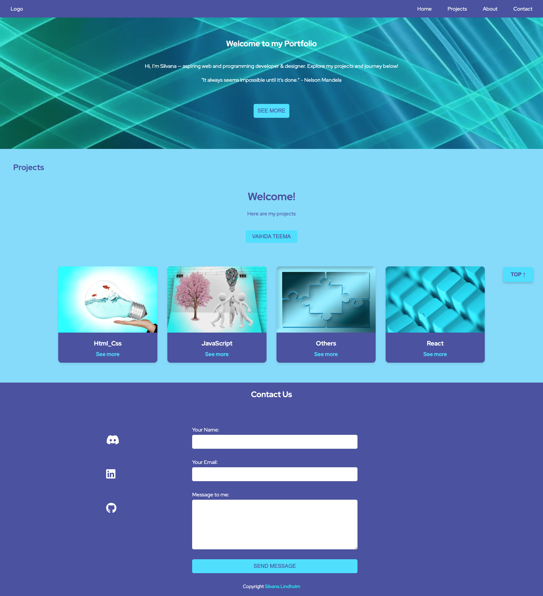
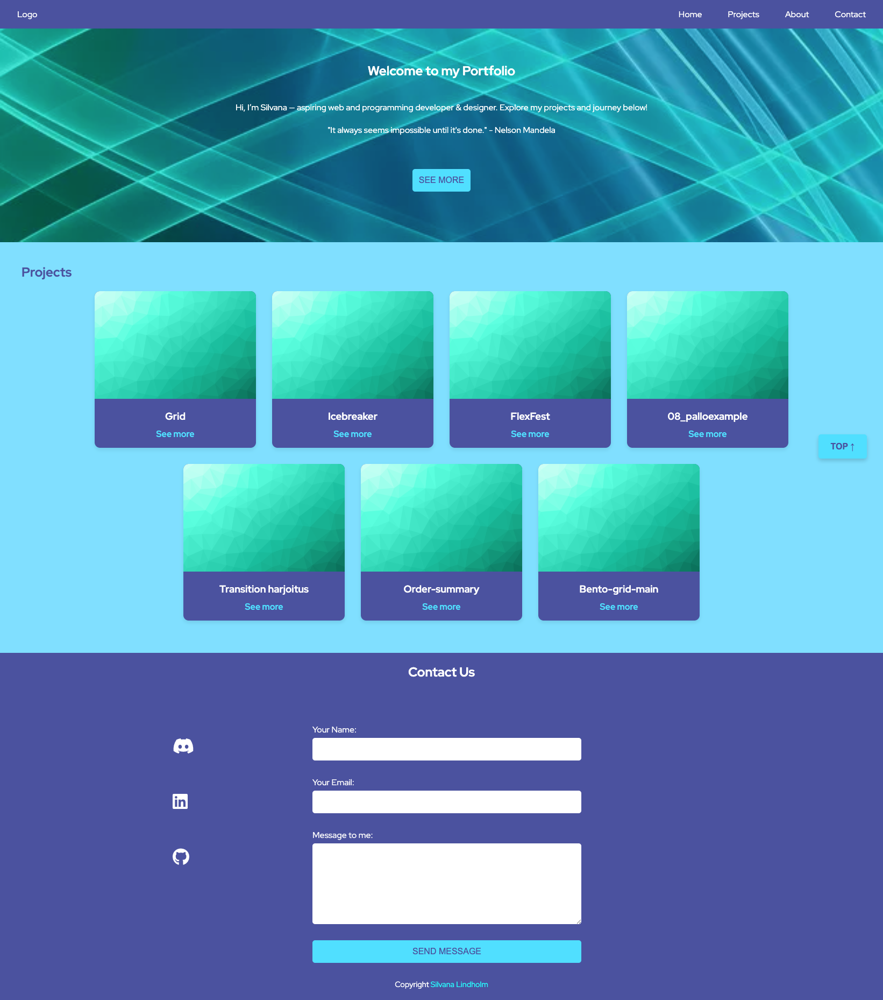

# readmetest
# Silvana Lindholm - Personal Portfolio

**Welcome to my Portfolio!** 

This is my personal website where you’ll find my **projects, skills, certificates, and education background** — as well as ways to connect with me.  

I created this portfolio to present my work in a clean, modern, and responsive way.  
It’s not only a collection of projects, but also a reflection of my growth as I continue to learn new technologies.

------

## Screenshot

.png>)






.png>)

------


----

## 📋 Features

- **Responsive design** – works on desktop, tablet, and mobile.
- **About section** – short introduction and personal background.
- **Skills section** – list of technologies and tools I use.
- **Projects showcase** – highlight of selected works with descriptions.
- **Certificates and education** – proof of skills and learning journey.
- **Contact form** – send me a message directly from the website.
- **Social links** – connect with me via LinkedIn, GitHub, and more.

---

## 🛠️ Built With

- **HTML5** – semantic and accessible structure
- **CSS3** – custom styling, responsive layouts
- **JavaScript** – interactive features
- **Google Fonts** – for typography
- **Netlify** – hosting with HTTPS

---

## 🚀 Getting Started

To run this project locally:

```bash
# Clone the repository
git clone https://github.com/1967cooder/harjoitukset/tree/main/Portfolio%20Silvana
# Open index.html in your browser
# Navigate to the portfolio folder
cd harjoitukset/Portfolio\ Silvana
```
-------
## Repository Location

This project is part of my learning and practice repository:
[Harjoitukset](https://github.com/1967cooder/harjoitukset)

### Project: Portfolio Silvana
- [Portfolio folder](https://github.com/1967cooder/harjoitukset/tree/main/Portfolio%20Silvana)
- HTML
- CSS
- Java Script 
- React
-----

### HTML projects
Here are few examples of my HTML projects:


## Links

🌐 [Git HUb URL](https://github.com/1967cooder/harjoitukset/tree/main/Portfolio%20Silvana/)
🌐 [Live Demo](https://portfoliosilvana.netlify.app/)


## Contact

Silvana Lindholm

Portfolio: [Live Demo](https://portfoliosilvana.netlify.app/)

GitHub [1967cooder](https://github.com/1967cooder)

LinkedIn: [LinkedIn](https://linkedin.com/in/silvanalindholm/)

Email: (silvanalindholm@hotmail.com/)

## ✨ This portfolio is a continuous work in progress as I grow my skills and add new projects.