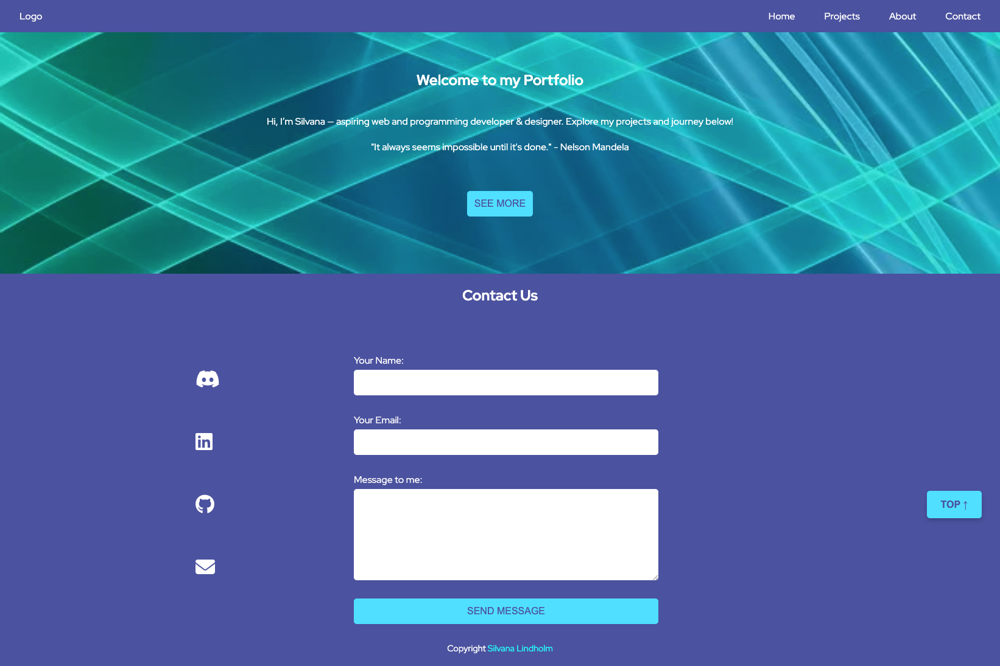

# readmetest
# Silvana Lindholm - Personal Portfolio

## Welcome to my Portfolio!

This is my personal website where you’ll find my **projects, skills, certificates, and education background** — as well as ways to connect with me.  

I created this portfolio to present my work in a clean, modern, and responsive way.  
It’s not only a collection of projects, but also a reflection of my growth as I continue to learn new technologies.

------

## Screenshot

.png>)





.png>)

------

## 📋 Features

- **Responsive design** – works on desktop, tablet, and mobile.
- **About section** – short introduction and personal background.
- **Skills section** – list of technologies and tools I use.
- **Projects showcase** – highlight of selected works with descriptions.
- **Certificates and education** – proof of skills and learning journey.
- **Contact form** – send me a message directly from the website.
- **Social links** – connect with me via LinkedIn, GitHub, and more.

---

## 🛠️ Built With

- **HTML5** – semantic and accessible structure
- **CSS3** – custom styling, responsive layouts
- **JavaScript** – interactive features
- **Google Fonts** – for typography
- **Netlify** – hosting with HTTPS

---

## 🚀 Getting Started

To run this project locally:

```bash
# Clone the repository
git clone https://github.com/1967cooder/harjoitukset/tree/main/Portfolio%20Silvana
# Open index.html in your browser
# Navigate to the portfolio folder
cd harjoitukset/Portfolio\ Silvana
```
-------

## Repository Location

This project is part of my learning and practice repository:
[Harjoitukset](https://github.com/1967cooder/harjoitukset)


 Here are several HTML, CSS, JavaScript projects I've developed. You can explore the source code, and also see live version and more details on my [Portfolio website](https://portfoliosilvana.netlify.app/) 🌐 
 
 
## JavaScript projectts

### Portfolio

- [Live Demo](https://portfoliosilvana.netlify.app/)
- [Git HUb URL](https://github.com/1967cooder/)

### Pankkiautomaattisimulaattori

A bankk ATM simulator demonstrating user input and logic handling.

- [Live demo](https://pankkiautomaatti.netlify.app/)
The code is 1234
-  [GitHub](https://github.com/1967cooder/harjoitukset/tree/main/Pankkiautomaatti)  

### Pikku eläintarha
 
 A small interactive zoo app to practice DOM manipulation

- [Live Demo](https://pikku-elaintarha.netlify.app/)  
- [GitHub Repository](https://github.com/1967cooder/harjoitukset/tree/main/Portfolio%20Silvana/pikku_el%C3%A4intarha%20copy) 

###  Pannukakkusivu3

Interaktiivinen pannukakun tilaussivu sekä erillinen hallintasivu tilausten käsittelyyn. Projektissa käytettiin **HTML**, **CSS** ja **JavaScript** -tekniikoita sekä **localStorage**-tallennusta.


- [Git Hub](https://github.com/1967cooder/harjoitukset/tree/main/Portfolio%20Silvana/Pannukakkusivu3%20copy)

Tilaussivu [Live demo](https://pannukakkusivu3.netlify.app/)  
*(salasana: `pannukakku123`)*

Tilauksien halintasivu [Live demo](https://pannukakkusivu3.netlify.app/orders)
*(salasana: `pannukakku123`)*

### Product list with cart solution

This is a solution to the [Product list with cart challenge on Frontend Mentor](https://www.frontendmentor.io/challenges/product-list-with-cart-5MmqLVAp_d).

- [Live Demo](https://bestdesserts.netlify.app/)
- [Git Hub URL](https://github.com/1967cooder/harjoitukset/tree/main/product-list-with-cart-main/)


 ## HTML/CSS projects

 ### FlexFest 2025

FlexFest 2025 is a responsive festival website that showcases the event program, tickets, location, gallery, and contact details.  
The site is built with **HTML5** and **CSS3**, designed to work on both desktop and mobile devices.

- [Live demo](https://flexfest.netlify.app/)
- [GitHub](https://github.com/1967cooder/harjoitukset/tree/main/Portfolio%20Silvana/01_flex-projecti%20copy)

### Order Summary Card

This is a solution to the [Order Summary Card challenge on Frontend Mentor](https://www.frontendmentor.io/challenges/order-summary-component-QlPmajDUj). This challenge helps improve coding skills by building realistic UI components.

- [Live Demo](https://order-summary-card-silva.netlify.app/)
- [GitHub Repository](https://github.com/1967cooder/harjoitukset/tree/main/Portfolio%20Silvana/order-summary-component-main)  

### Bento Grid Challenge

This is a solution to the [Frontend Mentor Bento Grid challenge](https://www.frontendmentor.io/challenges/bento-grid-6e0q6h_bH). The challenge is to build a responsive layout using CSS Grid and Flexbox that matches the provided design.

- [Live Demo](https://order-summary-card-silva.netlify.app/)
- [GitHub Repository](https://github.com/1967cooder/harjoitukset/tree/main/Portfolio%20Silvana/order-summary-component-main)  


## React

is comming
-----


## Links

🌐 [Git HUb URL](https://github.com/1967cooder/harjoitukset/tree/main/Portfolio%20Silvana/)
🌐 [Live Demo](https://portfoliosilvana.netlify.app/)


## Contact

Silvana Lindholm

Portfolio: [Live Demo](https://portfoliosilvana.netlify.app/)

GitHub [1967cooder](https://github.com/1967cooder)

LinkedIn: [LinkedIn](https://linkedin.com/in/silvanalindholm/)

Email: silvanalindholm@hotmail.com/

## ✨ This portfolio is a continuous work in progress as I grow my skills and add new projects.