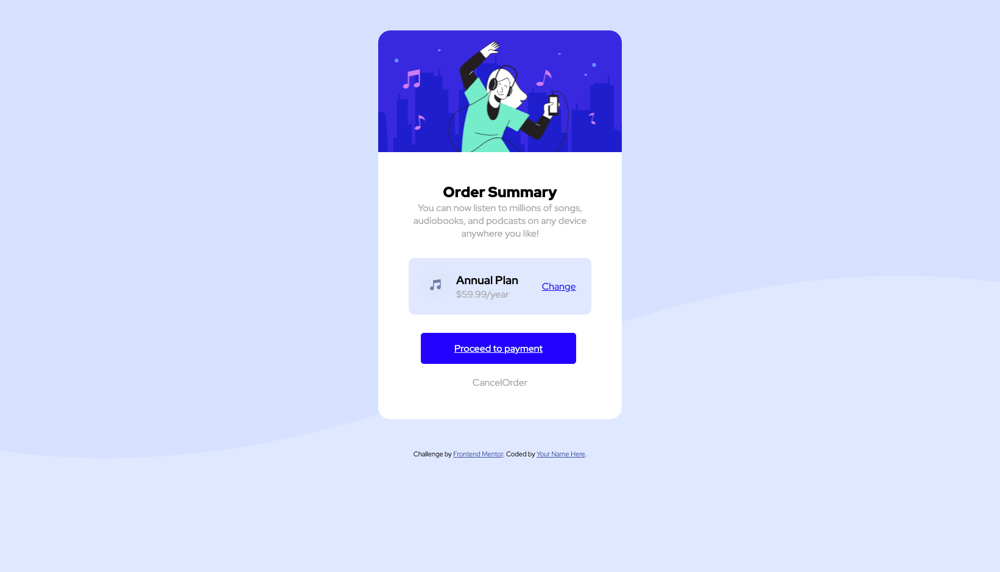
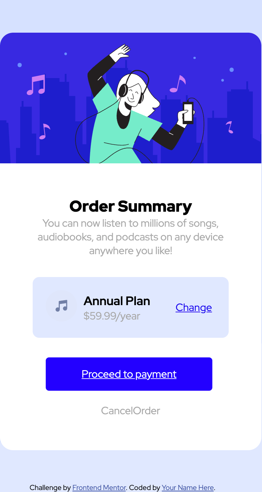

# Frontend Mentor | Order Summary Card

This is a solution to the [Order Summary Card challenge on Frontend Mentor](https://www.frontendmentor.io/challenges/order-summary-component-QlPmajDUj). This challenge helps improve coding skills by building realistic UI components.

---

## Table of Contents

- [Overview](#overview)
  - [The Challenge](#the-challenge)
  - [Screenshot](#screenshot)
  - [Links](#links)
- [My Process](#my-process)
  - [Built With](#built-with)
  - [What I Learned](#what-i-learned)
  - [Continued Development](#continued-development)
  - [Useful Resources](#useful-resources)
- [Author](#author)
- [Acknowledgments](#acknowledgments)

---

## Overview

### The Challenge

Users should be able to:

- See hover states for interactive elements
- View the card in both desktop and mobile layouts
- Understand a clear layout with plan details and payment options

### Screenshot





### Links

- [GitHub Repository](https://github.com/1967cooder/harjoitukset/tree/main/Portfolio%20Silvana/order-summary-component-main)  
- [Live Demo](https://order-summary-card-silva.netlify.app/)

---

## My Process

### Built With

- Semantic HTML5 markup
- CSS3 (Flexbox, Grid, custom properties)
- Mobile-first workflow
- Google Fonts (Red Hat Display)
- Vanilla JavaScript (optional for interactive elements)

### What I Learned

During this project, I learned:

- How to create a **clean card layout** using Flexbox and Grid
- Implementing **mobile-first responsive design**
- Styling **hover states** and buttons consistently
- Using **semantic HTML5** elements for accessibility
- Structuring the markup to match a **design mockup**

## Example of a CSS snippet I was proud of:

```css
.link-button{
    display: block;/*laattikko*/
    margin: 20px;
    background-color: blue;
    width: 85%;
    padding: 15px;
    color: white;
    border-radius: 5px;

 }

#plan-price {
    text-align: left;
    flex-grow: 3;
    padding-left: 10px;
}
```
---

## Continued Development

I plan to further improve by:

Adding JavaScript interactivity, e.g., toggle between annual/monthly plans

Exploring CSS animations for smoother hover effects

Enhancing accessibility with better ARIA roles

## Useful Resources

Frontend Mentor
 – for challenges and designs
 CSS-Tricks Flexbox Guide
 – helped me understand Flexbox layouts
 https://www.w3schools.com/css/css_grid_container.asp


## Author

- GitHub – [1967cooder](https://github.com/1967cooder)  

## Contact

Portfolio: [Live Demo](https://portfoliosilvana.netlify.app/)

GitHub [1967cooder](https://github.com/1967cooder/)

LinkedIn: https://www.linkedin.com/in/silvanalindholm

Email: silvanalindholm@hotmail.com

Frontend Mentor - [@1967cooder
](https://www.frontendmentor.io/profile/1967cooder)


## Acknowledgments

Thanks to Frontend Mentor for the challenge and assets

Google Fonts for typography

Tutorials on Flexbox and CSS Grid that helped me structure the layout