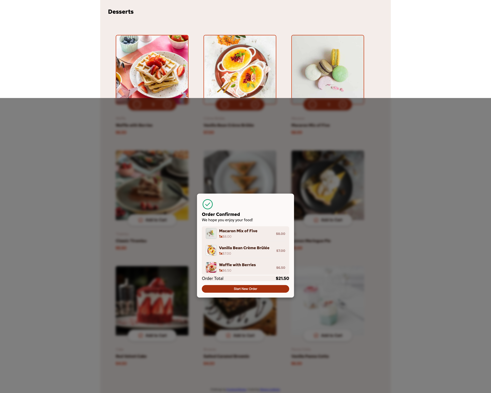

# Frontend Mentor - Product list with cart solution

This is a solution to the [Product list with cart challenge on Frontend Mentor](https://www.frontendmentor.io/challenges/product-list-with-cart-5MmqLVAp_d). Frontend Mentor challenges help you improve your coding skills by building realistic projects. 

## Table of contents

- [Overview](#overview)
  - [The challenge](#the-challenge)
  - [Screenshot](#screenshot)
  - [Links](#links)
- [My process](#my-process)
  - [Built with](#built-with)
  - [What I learned](#what-i-learned)
  - [Continued development](#continued-development)
  - [Useful resources](#useful-resources)
- [Author](#author)
- [Acknowledgments](#acknowledgments)


## Overview

### The challenge

Users should be able to:

- Add items to the cart and remove them
- Increase/decrease the number of items in the cart
- See an order confirmation modal when they click "Confirm Order"
- Reset their selections when they click "Start New Order"
- View the optimal layout for the interface depending on their device's screen size
- See hover and focus states for all interactive elements on the page

### Screenshot





### Links

- Solution URL: [Add solution URL here](https://your-solution-url.com)
- Live Site URL: [Add live site URL here](https://your-live-site-url.com)

## My process

Built with

- Semantic HTML5 markup
- CSS custom properties
- Flexbox
- CSS Grid
- Mobile-first workflow
- 
Vanilla JavaScript (dynamic rendering, cart logic, modal handling)

### What I learned

This project helped me practice:

.Managing cart state with JavaScript objects and arrays

.Saving and loading cart data using localStorage

.Creating a modal window for order confirmation

.Building responsive grid layouts for both mobile and desktop

To see how you can add code snippets, see below:

```html
.proud-of-this-html
<section class="orderConfirmed" style="display:none;">
  
      
      <h3>Order Confirmed
    </h3>
    <p>We hope you enjoy your food!</p>

    <div id="confirmed-items"></div>

    <div id="orderTotalConfirmed">Order Total</div>

    <button id="startNewOrder" class="hidden">Start New Order</button>
  </section>
```
```css
.proud-of-this-css {
.cart {
    width: 300px;
    min-width: 260px;
    background-color: hsl(20, 50%, 98%);
    color: hsl(14, 65%, 9%);
    padding: 1rem 1.5rem;
    border-radius: 16px;
    box-shadow: 0 2px 6px rgba(0,0,0,0.2);
    position: sticky;
    top: 2rem; /* залепен отгоре при скрол */
    height: fit-content;

  }
}
```
```js
fetch("data.json")
    .then((response) => response.json())
    .then((products) => {
      products = products.map((p, index) => ({ id: index + 1, ...p }));
      renderProducts(products);
      updateCartUI();
    })
    .catch((error) =>
      console.error("Грешка при зареждане на продуктите:", error)
    );
```


### Continued development

Since this project was very difficult for me, in the future I want to:

✅ Practice more with JavaScript
✅ Practice more with Local Storage
✅ Practice more with CSS
✅ Practice more with Grid


### Useful resources

- [Example resource 1](https://https://www.w3schools.com/)
- [Example resource 1](https://cssgridgarden.com/)

## Links
- [Git Hub URL](https://github.com/1967cooder/harjoitukset/tree/main/product-list-with-cart-main/)
- [Live Demo](https://bestdesserts.netlify.app/)

## Author

Silvana Lindholm

## Contact

Portfolio: [Live Demo](https://portfoliosilvana.netlify.app/)

GitHub [1967cooder](https://github.com/1967cooder/)

LinkedIn: (https://www.linkedin.com/in/silvanalindholm/)

Email: (silvanalindholm@hotmail.com/)

- Frontend Mentor - [@1967cooder
](https://www.frontendmentor.io/profile/1967cooder)


## Acknowledgments

Special thanks to Frontend Mentor for providing this challenge. I worked alone.

